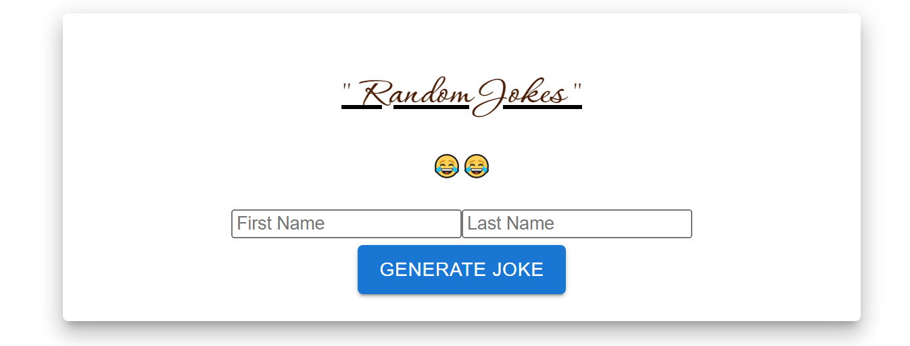
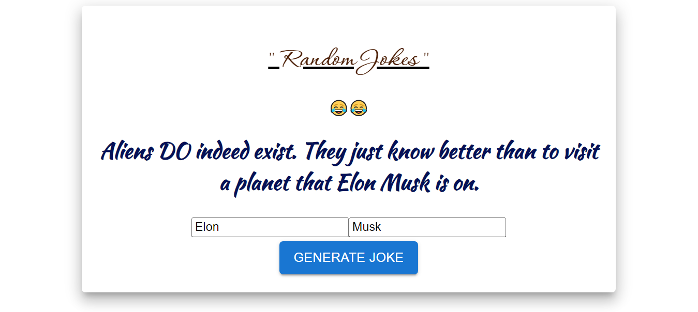

# React Web 3.0 App

### _Random Joke Web Application using ReactJs_

### Learned from : [Sonny Sangha](https://youtu.be/nshyjApIovo)

## Images

**NOTE: It's not Mobile Responsive**

## Run Locally

- Run this command to git clone. 

         https://github.com/aliaftabsheikh/Random-Jokes-React-App.git

- You are now in the dev environment and you can play around

## Technologies Use

- HTML5
- CSS3
- React js (Frontend)
- API (fetching data)
